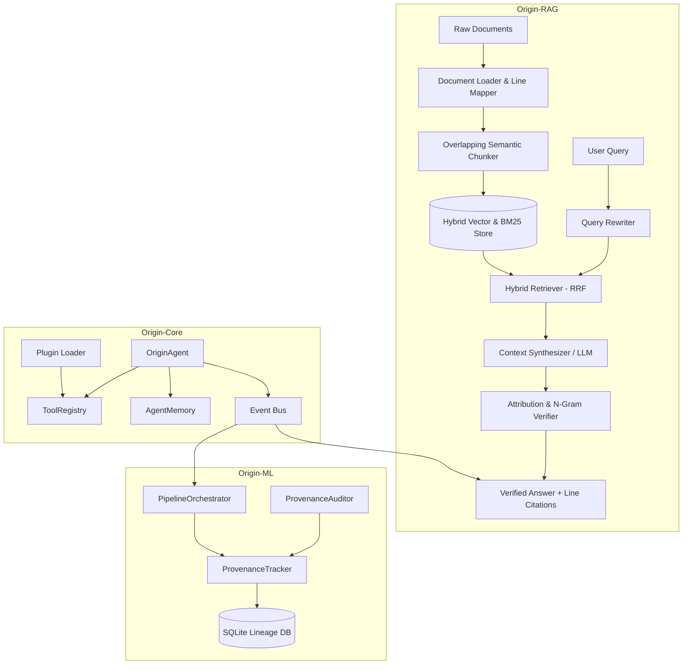

# 📍 Origin: Autonomous AI Agent Ecosystem with Verifiable Intelligence

[](LICENSE)
[](pyproject.toml)
[](tests/)
[](origin_rag/api/main.py)
[]()

> **Origin** is an autonomous AI agent ecosystem combining a production-grade **RAG engine** with verifiable source attribution, an **agent micro-kernel** for tool-augmented decision loops, and an **ML provenance tracker** for experiment integrity — all connected via an event-driven architecture.

---

## 📑 Table of Contents
- [What the Project Does](#-what-the-project-does)
- [Why It Is Useful](#-why-it-is-useful)
- [Key Features](#-key-features)
- [System Architecture](#-system-architecture)
- [Quickstart & Installation](#-quickstart--installation)
- [Usage Examples](#-usage-examples)
- [API Reference](#-api-reference)
- [Testing](#-testing)
- [Contributing](#-contributing)
- [License](#-license)

---

## 🚀 What the Project Does

Origin-RAG indexes your internal document knowledge base (Markdown, Text, Code, PDFs) while preserving exact file paths, section headers, and line-level numbers (`start_line` to `end_line`).

When a query is received:
1. **Hybrid Retrieval:** Merges dense vector similarity with sparse BM25 keyword matching using Reciprocal Rank Fusion (RRF).
2. **Context-Constrained Synthesis:** Generates accurate responses with strict instruction constraints.
3. **Line-Level Attribution Verification:** Computes n-gram semantic overlap between the answer and source chunks, appending precise citations (e.g., `[Source: system_architecture.md#L10-L15]`).
4. **Hallucination Risk Scoring:** Calculates an explicit **Hallucination Risk Score** (0.0 to 1.0) and alerts users if generated content lacks evidence.

---

## 💡 Why It Is Useful

Most LLM RAG pipelines suffer from two critical flaws:
* **Unverifiable Claims:** LLMs answer questions convincingly without citing exact source lines.
* **Hallucination Invisibility:** Users cannot easily verify whether a factual detail came from their documents or the model's pre-trained memory.

`Origin-RAG` solves this by introducing **provenance-first indexing** and **automated post-generation verification**.

---

## ✨ Key Features

### Origin-RAG (Retrieval Engine)
- 🎯 **Line-Level Source Citation:** Pinpoints exact line numbers (`#L12-L18`) for every cited context chunk.
- ⚡ **Hybrid Retriever (Dense + Sparse):** Combines BM25 term weighting with cosine embedding similarity.
- 🛡️ **Hallucination Risk Score:** Real-time attribution scoring engine flagging ungrounded claims.
- 🔍 **Query Rewriter:** Semantic expansion with intent classification, synonym expansion, and sub-query decomposition.
- 🌐 **REST API & CLI:** Production FastAPI endpoints alongside an easy-to-use terminal interface.

### Origin-Core (Agent Kernel)
- 🤖 **OriginAgent Micro-Kernel:** State-graph execution loops with plan → act → observe cycles.
- 🧰 **ToolRegistry:** Decorator-based dynamic tool registration with schema validation.
- 🧠 **AgentMemory:** Sliding-window short-term + persistent long-term memory management.
- 📡 **Event Bus:** Pub/sub inter-agent communication with priority-ordered topic routing.
- 🔌 **Plugin Loader:** Runtime tool discovery from external Python modules.

### Origin-ML (Provenance & Lineage)
- 🔐 **ProvenanceTracker:** SHA-256 dataset and prompt hashing for experiment reproducibility.
- 🔍 **ProvenanceAuditor:** Tamper detection verifying data integrity against stored hashes.
- 🔗 **PipelineOrchestrator:** Multi-stage workflow chaining with automatic lineage capture.

---

## 🏗️ System Architecture



---

## 📦 Quickstart & Installation

### Prerequisites
- Python >= 3.9

### Installation

```bash
# Clone the repository
git clone https://github.com/Dharmendra-05/Origin.git
cd Origin

# Install in editable mode with development dependencies
pip install -e ".[dev]"
```

---

## 💻 Usage Examples

### 1. Python SDK

```python
from origin_rag.pipeline import OriginRAGPipeline

# Initialize pipeline
pipeline = OriginRAGPipeline()

# Ingest knowledge base
pipeline.ingest_directory("sample_data/knowledge_base")

# Execute query with line-level attribution
result = pipeline.query("What is the attribution formula in Origin-RAG?")

print("Answer:", result.answer)
print("Hallucination Risk Score:", result.hallucination_score)
print("Citations:", result.citations)
```

### 2. Command Line Interface (CLI)

```bash
# Ingest documents
origin-rag ingest sample_data/knowledge_base

# Query with verification flag
origin-rag query "Explain the core components of the system" --verify
```

### 3. FastAPI Web Server

```bash
# Start server
uvicorn origin_rag.api.main:app --reload --port 8000
```
Open interactive API documentation at: `http://127.0.0.1:8000/docs`

---

## 📡 API Reference

| Endpoint | Method | Description |
| :--- | :--- | :--- |
| `/health` | `GET` | System status and loaded document count |
| `/ingest` | `POST` | Ingest local files or directories |
| `/query` | `POST` | Execute query & return answer with citations |
| `/verify` | `POST` | Calculate attribution score for external text |

---

## 🧪 Testing

Run the full automated test suite with coverage:

```bash
pytest tests/ --cov=origin_rag --cov=origin_core --cov=origin_ml
```

Test modules:
- `tests/test_chunker.py` — Chunking and overlap logic
- `tests/test_document_loader.py` — Document loading and line mapping
- `tests/test_pipeline.py` — End-to-end RAG pipeline integration
- `tests/test_origin_core.py` — Agent kernel, tools, and memory
- `tests/test_origin_ml.py` — Provenance tracking and tamper detection
- `tests/test_ml_pipeline.py` — Pipeline orchestrator stages
- `tests/test_query_rewriter.py` — Query rewriting and expansion

---

## 🤝 Contributing

Contributions are welcome! Please feel free to open an issue or submit a Pull Request.

---

## 📜 License

This project is licensed under the MIT License - see the [LICENSE](LICENSE) file for details.
